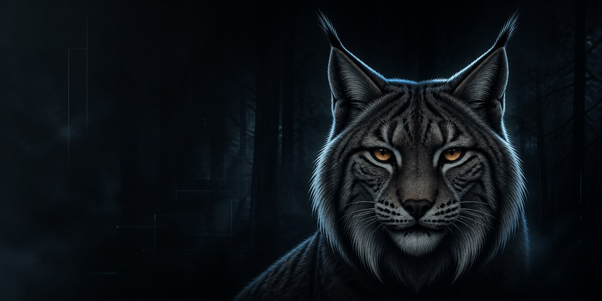

  

# Building communities, multiplayer systems, and developer tools

I design and ship products where software, identity, and online communities meet.
My work spans modern web platforms, Minecraft infrastructure, and focused automation.

## Selected work

### [Atrium](https://github.com/rahmibabapro/atrium)

A self-hostable community platform built as a forkable site foundation. Atrium combines
forums, identity, moderation, search, notifications, and migration tooling in one modern
Next.js codebase.

`TypeScript` · `Next.js` · `React` · `SQLite` · `PostgreSQL` · `Docker`

## What I focus on

- Community products with clear ownership and maintainable foundations
- Multiplayer systems designed for real operational constraints
- Small tools that remove repetitive work from creative teams

## Engineering approach

- Make the product understandable before making it clever
- Treat security, tests, and deployment as part of the feature
- Keep project history readable and changes reviewable

  Quiet systems. Sharp edges. Built to last.

